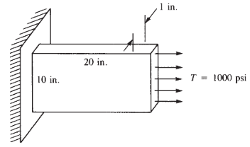

Although, computers get stronger day by day, time is still precious to all of us. Thus, we need to simplify our Finite Element Analysis (FEA) as an engiener. 2D Plane Stress and Strain Analysis is a very useful analysis type because of simplicty, speed and accuracy for the suitable model geometries, If the correct definitions are made. Finite Element Method means linear algebra. There is also a very powerful and easy and free [Python][Python] module, right here. It's name is [SymPy][SymPy]. `SymPy` is a very usefull module for symbolic mathematics and linear algebra.   

I would like to show an example of Daryl L. Logan's comprehensive book "A First Course in the Finite Element Method". A thin plate subjected to the surface traction shown in 

[SymPy]: https://www.sympy.org/en/index.html
[Python]: https://www.python.org/